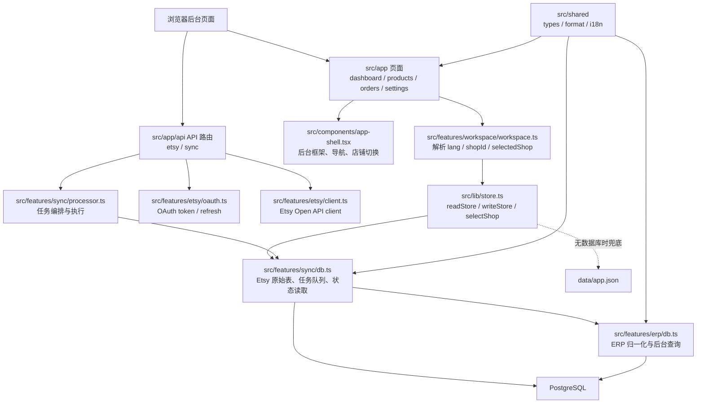
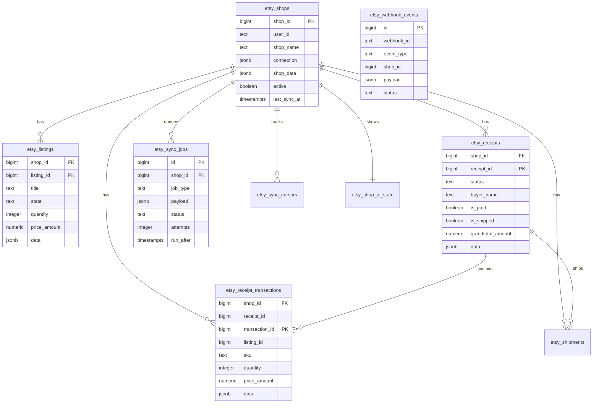
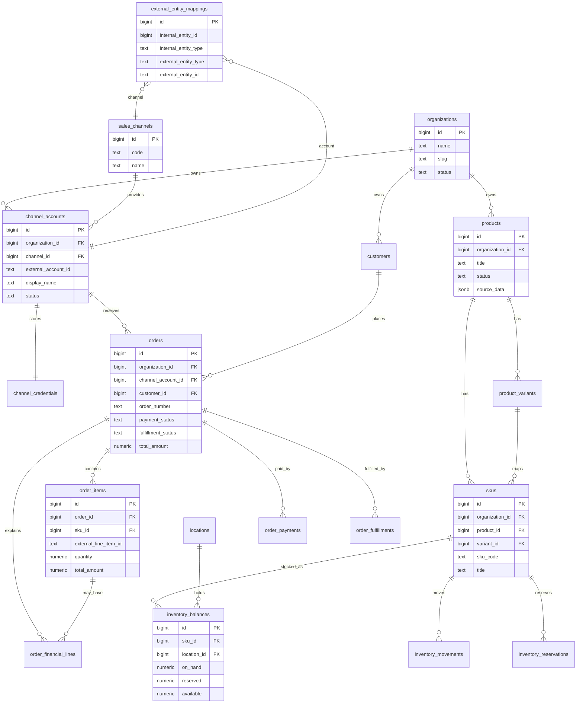
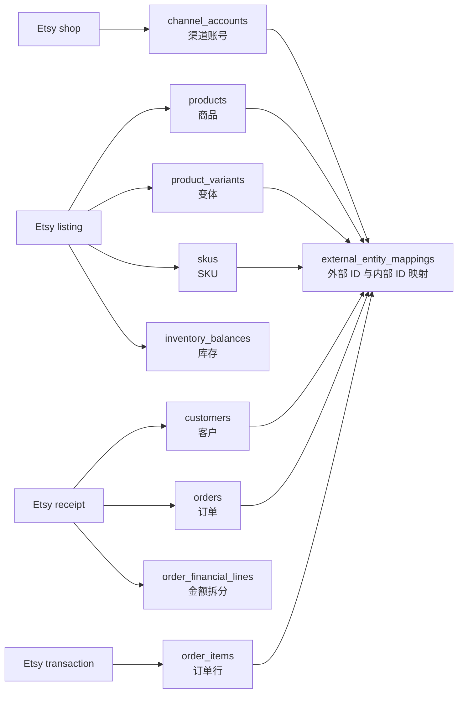
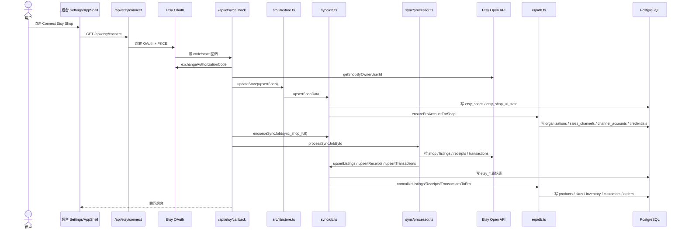
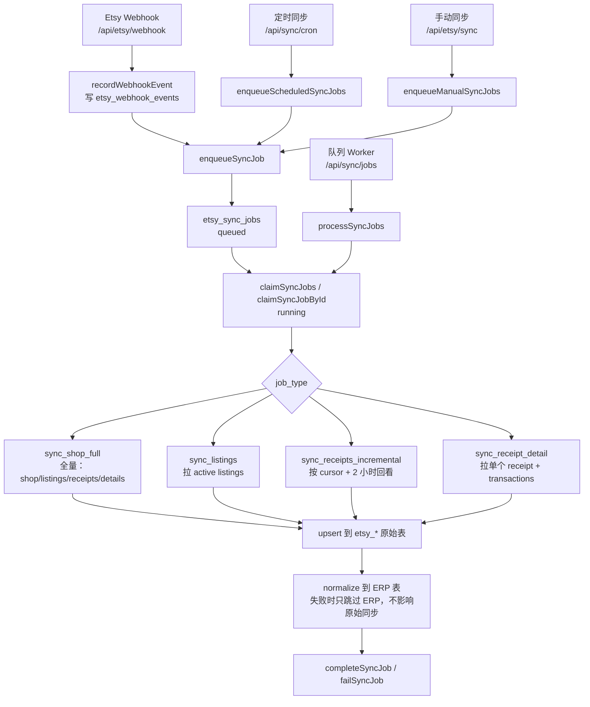
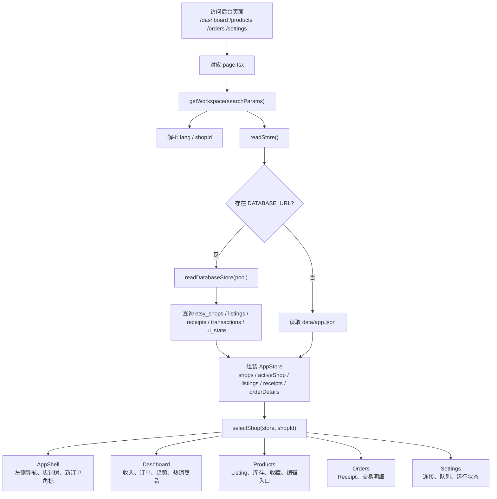
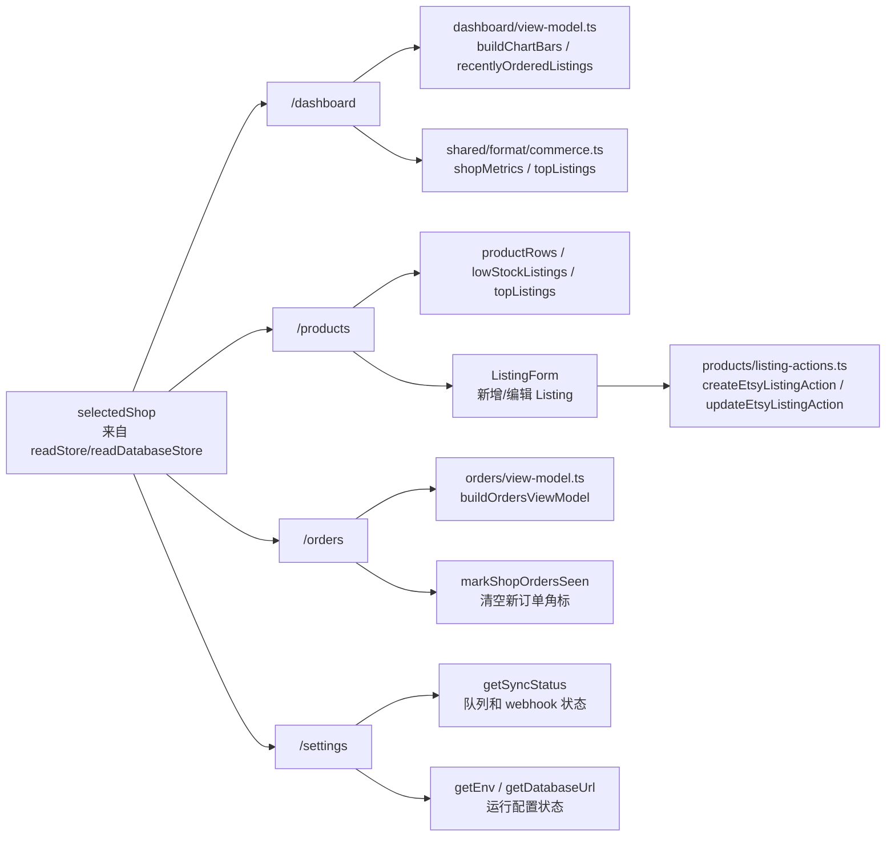
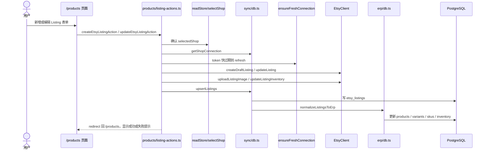
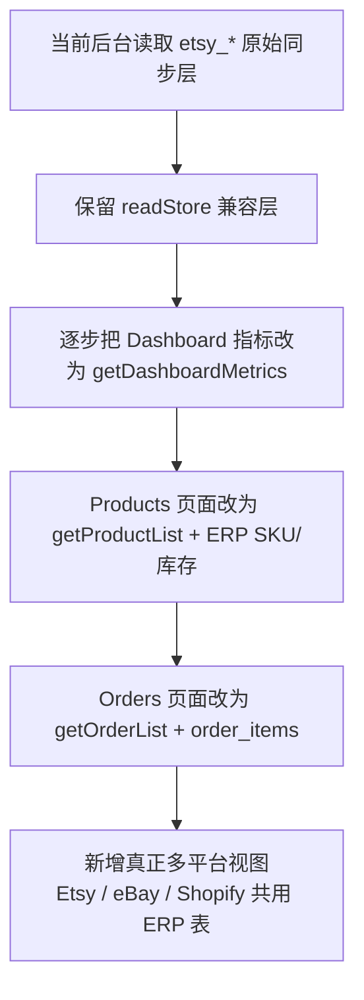

# 当前项目数据结构与后台展示流程图

本文按当前代码结构整理，核心结论是：

- 应用是 Next.js 后台系统，页面在 `src/app/*/page.tsx`，服务端 API 在 `src/app/api/*/route.ts`。
- 数据先进入 Etsy 原始同步层 `etsy_*` 表，再尝试归一化到平台无关的 ERP 表。
- 当前后台页面主要通过 `readStore()` 读取 `etsy_*` 原始同步层并组装成 `selectedShop` 展示。
- ERP 表已经具备商品、库存、订单、客户、多渠道账号的结构，后续可以逐步把页面改为直接读取 ERP 查询函数。

## 1. 项目实现分层

## 2. 当前数据库结构总览

### 2.1 Etsy 原始同步层

这层更接近 Etsy API 返回值，负责保留外部平台数据、同步游标、任务状态和新订单角标。

### 2.2 ERP 业务结构层

这层是平台无关结构，未来可以同时接 Etsy、eBay、Shopify 等渠道。

### 2.3 Etsy 到 ERP 的映射关系

## 3. 数据同步写入流程

### 3.1 首次连接 Etsy

### 3.2 Webhook、定时任务、手动同步

## 4. 后台展示流程

### 4.1 页面读取和渲染

### 4.2 各后台页面用到的数据

## 5. 商品写回 Etsy 流程

## 6. 当前可以继续优化的方向

